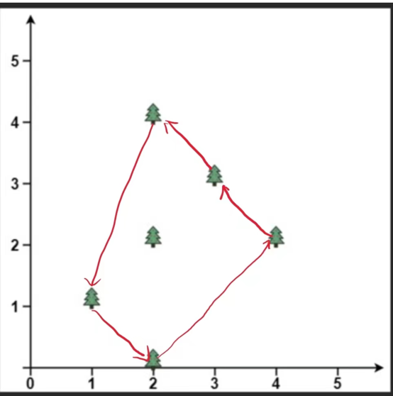

## 实验一：分治算法

### 实验目的
1. 掌握分治算法的设计思想与方法.
2. 熟练使用高级编程语言实现分治算法.
3. 通过对比简单算法以及不同的分治求解思想，理解算法复杂度.

### 实验问题
求解凸包问题：输入是平面上n个点的集合Q，凸包问题是要输出一个Q的
凸包。其中，Q的凸包是一个凸多边形P，Q中的点或者在P上或者在P中。


```
输入: points = [[1,1],[2,2],[2,0],[2,4],[3,3],[4,2]]
输出: [[1,1],[2,0],[3,3],[2,4],[4,2]]
```

### 实验步骤


4.1 实现基于枚举方法的凸包求解算法

```bash
python main.py --algo bruteForce 
```


4.2 实现基于 Graham-Scan 的凸包求解算法

```bash
python main.py --algo grahamScan 
```


4.3 实现基于分治思想的凸包求解算法
```bash
python main.py --algo div 
```


4.4 对比三种凸包求解算法 

（1）实现随机生成正方形(0,0)-(0,100)-(100,100)-(100,0)内的点集合 Q 的算法；

（2）利用点集合生成算法自动生成大小不同数据集合，如点数大小分别为(1000，
2000，3000…)的数据集合；

（3）对每个算法，针对不同大小的数据集合，运行算法并记录算法运行时间；

（4）对每个算法，绘制算法性能曲线，对比算法。
 