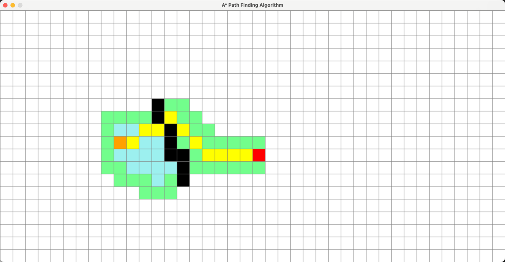
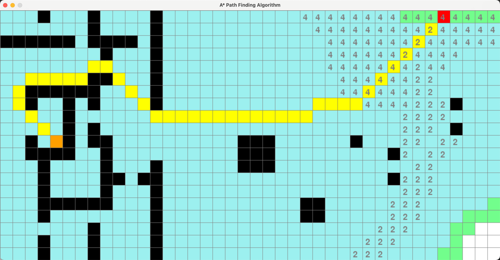
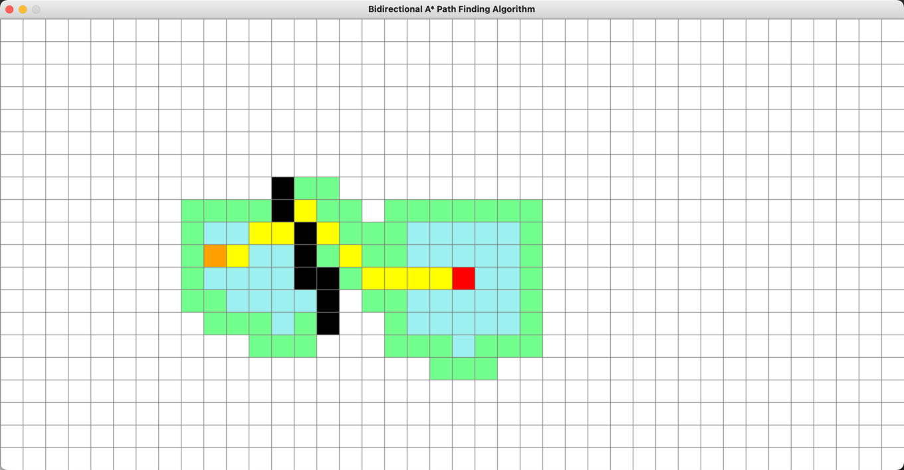
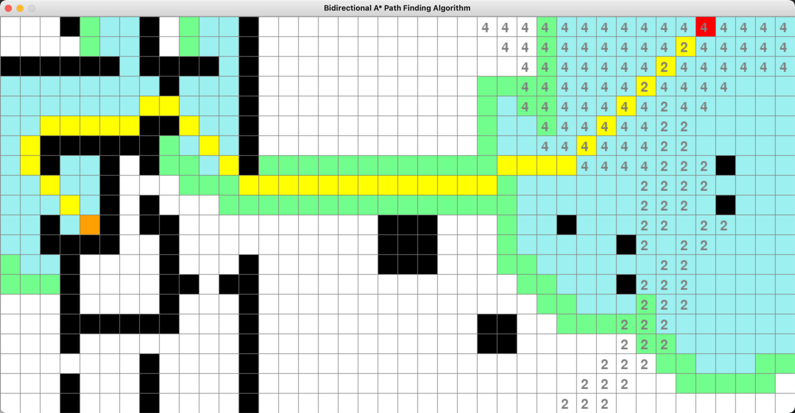

## 实验二：搜索算法

### 实验目的
1. 掌握搜索算法的基本设计思想与方法.
2. 掌握A*算法的设计思想与方法.
3. 熟练使用高级编程语言实现搜索算法.
4. 利用实验测试给出的搜索算法的正确性.


### 实验问题

寻路问题。输入一个方格表示的地图，要求用 A*算法找到并输出从起点（在方格中标示字母 S）到终点（在方格中标示字母 T）的代价最小的路径。有如下条件及要求：

1. 每一步都落在方格中，而不是横竖线的交叉点。
2. 灰色格子表示障碍，无法通行。
3. 在每个格子处，若无障碍，下一步可以达到八个相邻的格子，并且只可以到达无障碍的相邻格子。其中，向上、下、左、右四个方向移动的代价为 1， 向四个斜角方向移动的代价为√2。
4. 在一些特殊格子上行走要花费额外的地形代价。比如，黄色格子代表沙漠，经过它的代价为 4；蓝色格子代表溪流，经过它的代价为 2；白色格子为普通地形，经过它的代价为 0。
5. 经过一条路径总的代价为移动代价+地形代价。其中移动代价是路径上所做的所有移动的代价的总和；地形代价为路径上除起点外所有格子的地形代价的总和。比如，在下图的示例中，路径 A→B→C 的代价为√2+1(移动)+0(地形)，而路径 D→E→F 的代价为 2(移动)+6(地形)。


```
输入: 一张矩形map，包含高宽，起点，终点，格子里的代价
输出: 一条最优路径，从起点到终点。如果不存在，输出-1
```


### 实验步骤


1. 实现单向的A*搜索算法


```bash
python main.py --algo astar --data_path map1.txt # 地图1

python main.py --algo astar --data_path map2.txt # 地图2
```



2. 双向的A*搜索算法

```bash
python main.py --algo biastar --data_path map1.txt # 地图1

python main.py --algo biastar --data_path map2.txt # 地图2
```



> 操作指南——按下空格:开始，按下q:退出

    

    


 